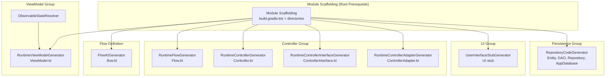
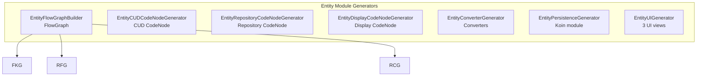
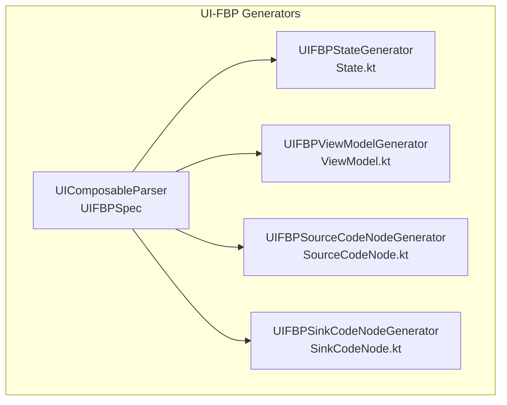

# Code Generation Dependency Analysis

**Feature**: 076-codegen-decomposition
**Date**: 2026-04-22

## 1. Generator Catalogue

### Module-Level Generators (used by saveModule)

| Generator | File | Output | Inputs | Dependencies |
|-----------|------|--------|--------|--------------|
| ModuleGenerator | generator/ModuleGenerator.kt | `build.gradle.kts` | FlowGraph, moduleName | None |
| FlowKtGenerator | generator/FlowKtGenerator.kt | `{Name}.flow.kt` | FlowGraph, packageName, ipTypeNames | None |
| RuntimeFlowGenerator | generator/RuntimeFlowGenerator.kt | `{Name}Flow.kt` | FlowGraph, generatedPackage | None |
| RuntimeControllerGenerator | generator/RuntimeControllerGenerator.kt | `{Name}Controller.kt` | FlowGraph, generatedPackage | None |
| RuntimeControllerInterfaceGenerator | generator/RuntimeControllerInterfaceGenerator.kt | `{Name}ControllerInterface.kt` | FlowGraph, generatedPackage | None |
| RuntimeControllerAdapterGenerator | generator/RuntimeControllerAdapterGenerator.kt | `{Name}ControllerAdapter.kt` | FlowGraph, generatedPackage | None |
| RuntimeViewModelGenerator | generator/RuntimeViewModelGenerator.kt | `{Name}ViewModel.kt` | FlowGraph, basePackage, generatedPackage | ObservableStateResolver |
| UserInterfaceStubGenerator | generator/UserInterfaceStubGenerator.kt | `userInterface/{Name}.kt` | FlowGraph, packageName | None (write-once) |
| RepositoryCodeGenerator | generator/RepositoryCodeGenerator.kt | Entity, DAO, Repository, BaseDao, AppDatabase, DatabaseModule, platform builders | FlowGraph, ipTypeProperties | None |
| ObservableStateResolver | generator/ObservableStateResolver.kt | StateFlow property declarations | FlowGraph source/sink ports | None |

### Entity Module Generators (used by saveEntityModule)

| Generator | File | Output | Inputs | Dependencies |
|-----------|------|--------|--------|--------------|
| EntityModuleGenerator | generator/EntityModuleGenerator.kt | Complete entity module (14+ files) | EntityModuleSpec | All entity generators |
| EntityFlowGraphBuilder | generator/EntityFlowGraphBuilder.kt | FlowGraph instance (3 nodes, 5 connections) | EntityModuleSpec | None |
| EntityCUDCodeNodeGenerator | generator/EntityCUDCodeNodeGenerator.kt | `nodes/{Entity}CUDCodeNode.kt` | EntityModuleSpec | None |
| EntityRepositoryCodeNodeGenerator | generator/EntityRepositoryCodeNodeGenerator.kt | `nodes/{Entity}RepositoryCodeNode.kt` | EntityModuleSpec | None |
| EntityDisplayCodeNodeGenerator | generator/EntityDisplayCodeNodeGenerator.kt | `nodes/{Plural}DisplayCodeNode.kt` | EntityModuleSpec | None |
| EntityConverterGenerator | generator/EntityConverterGenerator.kt (within EntityModuleGenerator) | `{Entity}Converters.kt` | entityName, properties | None |
| EntityPersistenceGenerator | generator/EntityPersistenceGenerator.kt | `{Plural}Persistence.kt` | EntityModuleSpec | None |
| EntityUIGenerator | generator/EntityUIGenerator.kt | 3 UI files (list, form, row) | EntityModuleSpec | None |

### UI-FBP Generators (used by UIFBPInterfaceGenerator)

| Generator | File | Output | Inputs | Dependencies |
|-----------|------|--------|--------|--------------|
| UIFBPInterfaceGenerator | generator/UIFBPInterfaceGenerator.kt | All 4-5 UIFBP files | UIFBPSpec | UIFBP sub-generators |
| UIFBPStateGenerator | generator/UIFBPStateGenerator.kt | `{Name}State.kt` | UIFBPSpec | None |
| UIFBPViewModelGenerator | generator/UIFBPViewModelGenerator.kt | `{Name}ViewModel.kt` | UIFBPSpec | None |
| UIFBPSourceCodeNodeGenerator | generator/UIFBPSourceCodeNodeGenerator.kt | `nodes/{Name}SourceCodeNode.kt` | UIFBPSpec | None |
| UIFBPSinkCodeNodeGenerator | generator/UIFBPSinkCodeNodeGenerator.kt | `nodes/{Name}SinkCodeNode.kt` | UIFBPSpec | None |

### Legacy/KotlinPoet Generators (pre-runtime generation, still in codebase)

| Generator | File | Purpose |
|-----------|------|---------|
| KotlinCodeGenerator | generator/KotlinCodeGenerator.kt | Legacy full project generation via KotlinPoet |
| ComponentGenerator | generator/ComponentGenerator.kt | Legacy node component generation via KotlinPoet |
| GenericNodeGenerator | generator/GenericNodeGenerator.kt | Legacy generic node component |
| FlowGenerator | generator/FlowGenerator.kt | Legacy flow orchestrator via KotlinPoet |
| FlowGraphFactoryGenerator | generator/FlowGraphFactoryGenerator.kt | Legacy factory function generation |
| BuildScriptGenerator | generator/BuildScriptGenerator.kt | Legacy build script generation |
| ConfigAwareGenerator | generator/ConfigAwareGenerator.kt | Configuration property utilities |
| ConnectionWiringResolver | generator/ConnectionWiringResolver.kt | Channel wiring resolution |
| RuntimeTypeResolver | generator/RuntimeTypeResolver.kt | Runtime type name resolution |

### Support Classes

| Class | File | Purpose |
|-------|------|---------|
| ObservableStateResolver | generator/ObservableStateResolver.kt | Analyzes FlowGraph source/sink ports → StateFlow properties |
| UIComposableParser | parser/UIComposableParser.kt | Parses Compose UI file → UIFBPSpec |
| ModuleSaveService | save/ModuleSaveService.kt | Orchestrator for saveModule() and saveEntityModule() |

## 2. Dependency Graph



### Entity Module Extensions



### UI-FBP Extensions



## 3. Module Scaffolding Component

**Identified as**: Root prerequisite for all generation paths.

**Current location**: Embedded within `ModuleSaveService.saveModule()` (lines 176-188) and `saveEntityModule()`.

**What it creates**:
- Module directory (`File(outputDir, effectiveModuleName)`)
- Source directory structure (`src/commonMain/kotlin/...`, `src/jvmMain/kotlin/...`)
- `build.gradle.kts` (via ModuleGenerator.generateBuildGradle)
- `settings.gradle.kts`

**Input**: Module name (derived from FlowGraph name or top bar settings)

**Extraction boundary**: Extract a `ModuleScaffoldingGenerator` class that:
- Takes a module name and output directory
- Creates the directory structure
- Generates gradle files
- Returns the module root directory path
- All other generators receive this path as input

## 4. Independent Generation Units

Generators that can operate independently (no inter-generator dependencies):

| Unit | Generators | Can Run Standalone? |
|------|-----------|-------------------|
| **Scaffolding** | ModuleGenerator (gradle) + directory creation | Yes — root prerequisite |
| **Flow Definition** | FlowKtGenerator | Yes — needs only FlowGraph |
| **Controller** | RuntimeFlow + Controller + Interface + Adapter | Yes — needs only FlowGraph |
| **ViewModel** | RuntimeViewModelGenerator + ObservableStateResolver | Yes — needs FlowGraph |
| **UI Stub** | UserInterfaceStubGenerator | Yes — needs FlowGraph |
| **Persistence** | RepositoryCodeGenerator | Yes — needs FlowGraph + IP type properties |
| **Entity Nodes** | EntityCUD + Repository + Display generators | Yes — needs EntityModuleSpec |
| **Entity UI** | EntityUIGenerator (3 files) | Yes — needs EntityModuleSpec |
| **Entity Persistence** | EntityPersistenceGenerator + Converters | Yes — needs EntityModuleSpec |
| **UI-FBP Interface** | UIFBP State + ViewModel + Source + Sink | Yes — needs UIFBPSpec |

## 5. Proposed Folder Hierarchy

### Current Layout (Addresses module)

```
Addresses/src/commonMain/kotlin/io/codenode/addresses/
├── Addresses.flow.kt          → flow/
├── AddressesViewModel.kt       → viewmodel/
├── AddressesPersistence.kt     → persistence/
├── AddressConverters.kt        → persistence/
├── generated/                  → split into flow/ and controller/
│   ├── AddressesFlow.kt        → flow/
│   ├── AddressesController.kt  → controller/
│   ├── AddressesControllerInterface.kt → controller/
│   └── AddressesControllerAdapter.kt   → controller/
├── nodes/                      → nodes/ (unchanged)
│   ├── AddressCUDCodeNode.kt
│   ├── AddressRepositoryCodeNode.kt
│   └── AddressesDisplayCodeNode.kt
└── userInterface/              → userInterface/ (unchanged)
    ├── Addresses.kt
    ├── AddUpdateAddress.kt
    └── AddressRow.kt
```

### Proposed Layout

```
Addresses/src/commonMain/kotlin/io/codenode/addresses/
├── flow/
│   ├── Addresses.flow.kt
│   └── AddressesFlow.kt
├── controller/
│   ├── AddressesController.kt
│   ├── AddressesControllerInterface.kt
│   └── AddressesControllerAdapter.kt
├── viewmodel/
│   └── AddressesViewModel.kt
├── nodes/
│   ├── AddressCUDCodeNode.kt
│   ├── AddressRepositoryCodeNode.kt
│   └── AddressesDisplayCodeNode.kt
├── userInterface/
│   ├── Addresses.kt
│   ├── AddUpdateAddress.kt
│   └── AddressRow.kt
└── persistence/
    ├── AddressesPersistence.kt
    └── AddressConverters.kt
```

### Mapping Summary

| Current Location | Proposed Location | Rationale |
|-----------------|-------------------|-----------|
| Root `{Name}.flow.kt` | `flow/` | Groups flow definition with flow runtime |
| Root `{Name}ViewModel.kt` | `viewmodel/` | Matches MVVM layer separation |
| Root `{Name}Persistence.kt` | `persistence/` | Groups persistence wiring |
| Root `{Entity}Converters.kt` | `persistence/` | Converters are persistence concern |
| `generated/{Name}Flow.kt` | `flow/` | Flow runtime belongs with flow definition |
| `generated/{Name}Controller*.kt` | `controller/` | Controller files group together |
| `nodes/` | `nodes/` | Already grouped correctly |
| `userInterface/` | `userInterface/` | Already grouped correctly |

## 6. CodeNode / GraphNode Mapping

### Potential CodeNodes (single-file generators)

Each of these generators produces a single file and could be wrapped as a CodeNode with typed input/output ports:

| Generator → CodeNode | Input Port | Output Port |
|---------------------|------------|-------------|
| FlowKtGenerator | FlowGraph | .flow.kt content |
| RuntimeFlowGenerator | FlowGraph | Flow.kt content |
| RuntimeControllerGenerator | FlowGraph | Controller.kt content |
| RuntimeControllerInterfaceGenerator | FlowGraph | ControllerInterface.kt content |
| RuntimeControllerAdapterGenerator | FlowGraph | ControllerAdapter.kt content |
| RuntimeViewModelGenerator | FlowGraph | ViewModel.kt content |
| UserInterfaceStubGenerator | FlowGraph | UI stub content |
| EntityCUDCodeNodeGenerator | EntityModuleSpec | CUD CodeNode content |
| EntityRepositoryCodeNodeGenerator | EntityModuleSpec | Repository CodeNode content |
| EntityDisplayCodeNodeGenerator | EntityModuleSpec | Display CodeNode content |
| EntityPersistenceGenerator | EntityModuleSpec | Persistence module content |
| UIFBPStateGenerator | UIFBPSpec | State.kt content |
| UIFBPViewModelGenerator | UIFBPSpec | ViewModel.kt content |
| UIFBPSourceCodeNodeGenerator | UIFBPSpec | Source CodeNode content |
| UIFBPSinkCodeNodeGenerator | UIFBPSpec | Sink CodeNode content |

### Potential GraphNodes (multi-file orchestrators)

These orchestrate multiple generators and could be represented as GraphNodes containing sub-graphs:

| Orchestrator → GraphNode | Contains |
|-------------------------|----------|
| ModuleSaveService.saveModule | Scaffolding + Flow + Controller(4) + ViewModel + UI + Persistence |
| EntityModuleGenerator | FlowGraphBuilder + Nodes(3) + Converters + Persistence + UI(3) + Runtime(4) |
| UIFBPInterfaceGenerator | State + ViewModel + Source + Sink + optional Flow |

### Root Prerequisite

| Component | Type | Notes |
|-----------|------|-------|
| Module Scaffolding | **Special CodeNode** | Must run first. Creates directory structure + gradle files. All other CodeNodes depend on it. |
